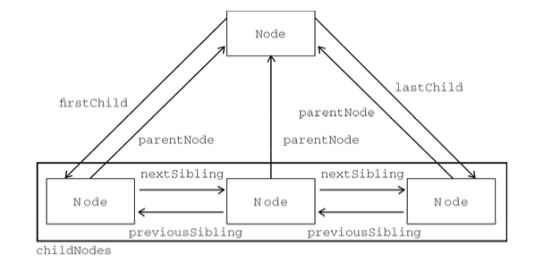

# JavaScriptDom  

### 前言：  
		Document Object Model文档对象模型， HTML DOM 是 W3C 标准（是 HTML 文档对象模型的英文缩写，Document Object Model for HTML）。HTML DOM 定义了用于 HTML 的一系列标准的对象，以及访问和处理 HTML 文档的标准方法。通过 DOM，可以访问所有的 HTML 元素，连同它们所包含的文本和属性。可以对其中的内容进行修改和删除，同时也可以创建新的元素。HTML DOM 独立于平台和编程语言。它可被任何编程语言诸如 Java、JavaScript 和 VBScript 使用。 	  
		js 即 JavaScript ，是一种网页脚本语言，可以在网页上实现一些动态效果。DOM 是HTML文档结构，其实就是为了能让js操作html元素而制定的一个规范，dom 的根本就是 document 对象，改对象有很多属性和方法，例如创建节点、复制节点、移除节点、修改属性等。  
		
### DOM树：
  

	dom按照层级的形式来划分：父节点 子节点 兄弟节点
	按照节点类型划分：1元素节点  2属性节点 3文本节点  8注释节点  9document节点  
	当网页被加载时，浏览器会创建页面的文档对象模型（Document Object Model）  
	HTML DOM 模型被构造为对象的树 如上图一样；

    
 
而通过JavaScript，我们能改变这颗树。

    JavaScript 能够改变页面中的所有 HTML 元素
    JavaScript 能够改变页面中的所有 HTML 属性
    JavaScript 能够改变页面中的所有 CSS 样式
    JavaScript 能够对页面中的所有事件做出反应   
  
### 增删改查
   
   
   		var id = document.getElementById('xxx');  通过id获取元素.
		var class = document.getElementsByClassName('xxx'); 通过class名获取元素，得到的是所有class名为xxx的数组。
		var tag = document.getElementsByTagName('xxx'); 通过标签名获取元素，得到的是个所有标签名为xxx的数组.  

获取节点：  
	首先建立一个ul

	<ul id="list">
		<li id=“li1”>10</li>
		<li id=“li2”>2</li>
		<li id=“li3”>3</li>
		<li id=“li4”>4</li>
		<li id=“li5”>5</li
		<!-- 注释内容 -->
	</ul>
	
	在js中获取ul li。
	var list = document.getElementById('list');
	var li1 = document.getElementById('li1');
	var li2 = document.getElementById('li2');
	var li3 = document.getElementById('li3');
	var li4 = document.getElementById('li4');
	var li5 = document.getElementById('li5');

	
	如果我们想获取ul的子节点可以用以下方法：
		1. list.children/list.childNodes 获取指定元素的第一层子节点.  即获取ul的所有第一层子节点，包括li、空白文档、以及注释
	区别是hildren 在标准浏览器和IE9下，不会造成空白文本解析，获取到的是真实的子节点，不支持IE6/7/8 childNodes会解析空白文本节点，
	
		2.list.firstChild 获取获取指定元素的第一个子节点 在ul中由于代码换行，获取的第一个子节点是li1上面的空白文本节点
		
		3.list.firstElementChild 获取指定元素的第一个类型为元素的子节点，在ul中获取的就是li1
		
		4.list.lastChild 获取获取指定元素的第一个子节点 在ul中由于代码换行，获取的第一个子节点是li5后面的的空白文本节点
		
		5.list.lastElementChild 获取指定元素的第一个类型为元素的子节点，在ul中获取的就是li5  
		
		6.li3.previousSibling 获取获取指定元素的上一个子节点 获取的是li3前面的空白文本节点
		
		7.li3.previousElementSibling 获取获取指定元素的上一个类型为元素子节点 获取的是li3前面的li2
		
		8.li3.nextSibling 获取获取指定元素的下一个子节点 获取的是li3后面的空白文本节点
		
		9.li3.nextElementSibling 获取获取指定元素的下一个类型为元素子节点 获取的是li3后面的li4
		
		10.li2.parentNode  获取指定元素的父节点  获取ul
		
		11.li2.offsetParent 获取指定元素的定位祖先节点  
		
	除了获取DOM节点，我们还能通过js获取设置元素属性，创建并设置节点；
	
		1.通过元素.属性名  获取不到非标准属性
		注意：如果获取的是元素的class的话，在写的时候必须是className
		
		2.getAttribute("属性名")  获取元素属性
		可以获取到元素的自定义属性
		setAttribute("属性名","属性值")  设置元素属性
		removeAttribute("属性名") 移除元素属性
	
		3.创建节点  document.createElement('标签名')
		  appendChild() 给指定元素追加子节点
		  在指定元素之前插入元素  insertBefore(插入的元素,参照元素)
		  removeChild()  移除子节点
		  replaceChild(替换元素，被替换元素)  替换子节点
		  cloneNode() 克隆节点 接受一个布尔值作为参数 当参数为true时，会克隆元素的innerHTML，false不会，默认是false。
### 下面给大家一个节点图
 

## 希望我的文章能给大家带来一定的帮助   
		
  

